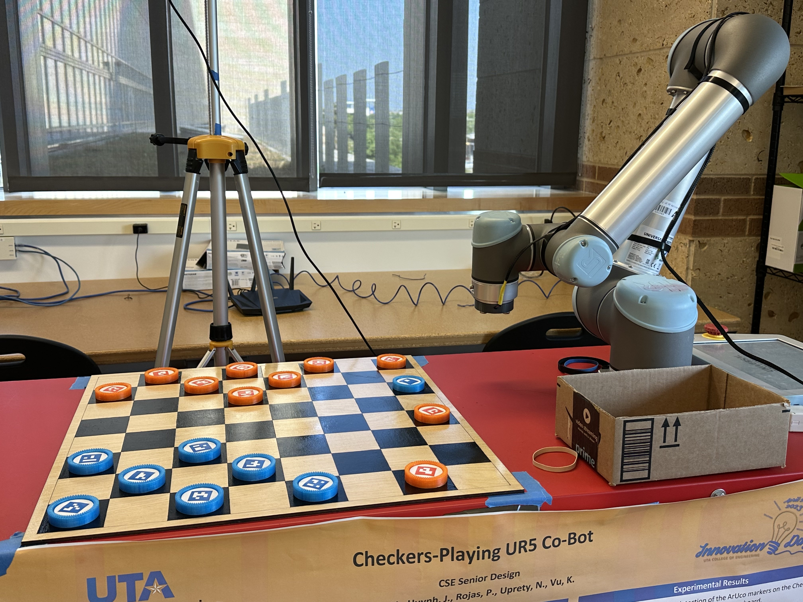
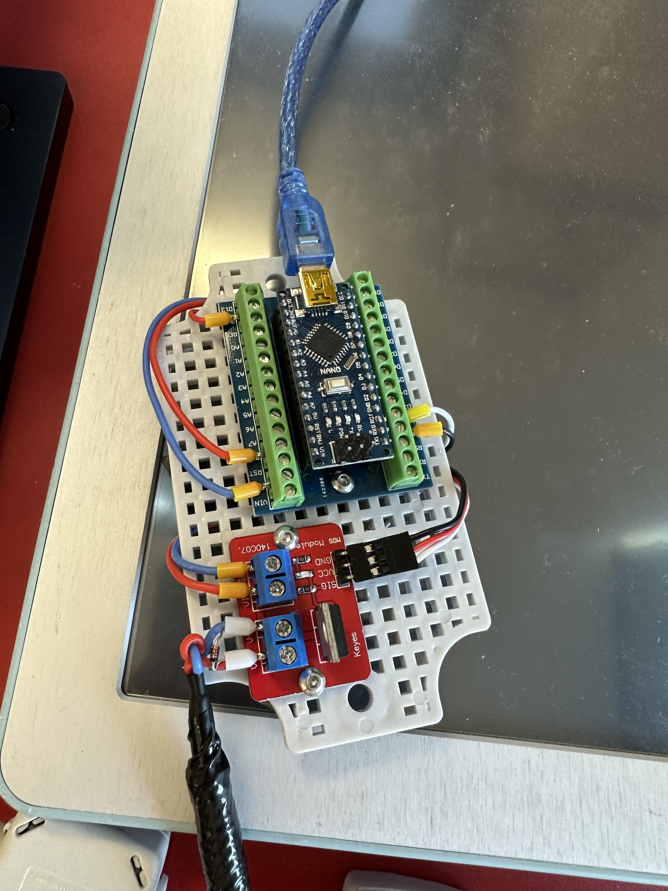

# CheckUR5
## About
A Fall 2022 - Spring 2023 UTA Senior Design project that allows the UR5 collaborative robot arm to play a game of checkers with a human player.

Team CheckUR5:
- Nimita Uprety
- Patricia Rojas
- Hoang Ho
- Joanna Huynh
- Kevin Vu

## Requirements
### Physical Items
- UR5 collaborative robot arm
- Intel RealSense Depth Camera D435i
- 21 inch x 21 inch checkerboard
  - 0.5 inch border on each side
  - 2.5 inch x 2.5 inch squares
- 24 2 inch diameter [checker pieces](./3d_models/checker piece final.stl)
  - With washers or any magnetic material attached and ArUco markers on top
- Electromagnet gripper
  - Electromagnet circuit with Arduino Nano and MOSFET module
  - [Arduino code](./arduino_magnet/arduino_magnet.ino)
- Checker piece collection box

### Dependencies
- Linux distribution Ubuntu 22.04 LTS
- Python 3.x, we used 3.10.6
- OpenCV
- [RealSense SDK 2.0](https://dev.intelrealsense.com/docs/compiling-librealsense-for-linux-ubuntu-guide)
- [ur_rtde](https://pypi.org/project/ur-rtde/)
- pyserial

## Setup
Ensure the UR5 is connected to the same network as the PC that is running the code. Connect the camera and Arduino to SS USB ports.
- By default, the game uses `/dev/ttyUSB0/` as the Arduino port and `192.168.1.102` as the UR5's IP address. To change these, change line 26 in the [Game code](./checkers/game.py)

Movement logic of robot depends on its placement relative to the checkerboard and collection box. Each square's position is calculated based on the square designated as the top-left square and the distance difference between each square.

- To change where the top left square is, change `TOP_LEFT` in the [Robot code](./checkers/robot.py)
- To change where the collection box is, change `BOX_POS` in the [Robot code](./checkers/robot.py)

**The position values we used are based on the "Base" feature.**

## Playing the game
1. Run [main.py](./main.py)
    - `python3 ./main.py`
2. Human player makes the first turn. Type `A` and press enter in the terminal to end the player's turn.
3. Enjoy!

## References
1. Techwithtim. (2020, September 3).“Techwithtim/Python-Checkers-AI/checkers: A checkers AI using the minimax algorithm.” Github, https://github.com/techwithtim/Python-Checkers-AI
2. Lindvig, A. P. (2022, October 31). Ur-rtde. PyPI. Retrieved April 7, 2023, from https://pypi.org/project/ur-rtde/ 
3. Söderby, K. (2023, March 9). Getting started with Arduino: Arduino documentation. Arduino Documentation | Arduino Documentation. Retrieved April 7, 2023, from https://docs.arduino.cc/learn/starting-guide/getting-started-arduino
4. UniversalRobots. (2012). Universal Robots User Manual Version 1.6. Universal Robots A/S.https://s3-eu-west-1.amazonaws.com/ur-support-site/17958/manual_en_UR5_CB2_1.6_US.pdf.
